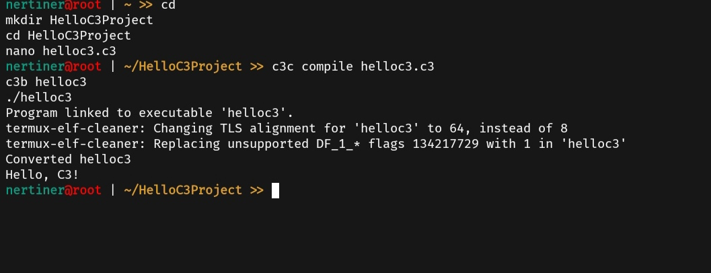

# C3C-android
A repository that will teach you how to download and execute C3C Compiler and run C3 in termux.

### Please Make a issue if any of the steps doesn't work, more dependencies may have to be added.
## Downloading and Setting Up Termux

### To download and Setup Termux you have to:
Download Termux Apk By Clicking [Here](https://github.com/termux/termux-app/releases/download/v0.118.1/termux-app_v0.118.1+github-debug_arm64-v8a.apk)

Open it and paste this:
```
termux-setup-storage
pkg update && pkg upgrade -y
apt install git wget -y
```

## Setting up C3C dependencies 
For this step you will need to install several dependencies and this can take a few minutes based on your device and wi-fi speed.

### Please make a issue if any dependencies are missing.
Run this on your terminal 

```
pkg install llvm llvmgold binutils binutils-gold libgc build-essential cmake llvm git libedit zlib clang make mlir llvm-tools libpolly python -y
```

## Downloading the C3C Repository and Compiling

You will have to complete a few steps to do this, first paste this in your terminal:
```
git clone https://github.com/c3lang/c3c.git
cd c3c
mkdir build
cd build
cmake ..
make
```
After this you should have an executable on your directory.

## Setting Up the Compiler

The next steps will be a bit more complex so I created a bash script to do this for you. This happens because Termux is different of a real linux enviroment.

You can run this on your terminal:
```
cd
wget https://raw.githubusercontent.com/Nertiner/c3c-android/refs/heads/main/setup.sh
chmod +x setup.sh
./setup.sh
```
This will take some time so please be patient. 
After it finishes you will have c3c compiler almost ready for you.
### But we are not done yet

### Running C3C generated binaries

Until now we can't execute the generated binaries in termux after compiled, we need to firstly convert it to make it work with Android Bionic, as I said, termux is different of the real linux.

So here you have to use the c3b, the C3 Bionic Converter that converts the compiled executable into one compatible with Android Bionic. It was installed when you run the setup bash file and it is currently ready for use.
### Remember that the C3B is not officially from the C3 Programming Language Organization.

Use it in this way:
```
c3b myexecutable
```
After this you can run your file normally with 
```
./myexecutable
```
From now that is it, have fun coding!
The next steps below are just testing and more information.

## Testing C3C

You can test it by running 
```
cd
mkdir HelloC3Project
cd HelloC3Project
nano helloc3.c3
```

Then you paste this:
```
module helloc3;
import std::io;

fn void main()
{
io::printn("Hello, C3!");
}
```

Press CTRL + S and CTLR + X
Compile it, convert and run with:

```
c3c compile helloc3.c3
c3b helloc3
./helloc3
```

You should see this after running:

```Hello, C3!```

And that is it!
Have fun with C3, any issues related to the language compiler itself please report in the C3C github repository: 
https://github.com/c3lang/c3c

### Screenshot



## Have Fun!
